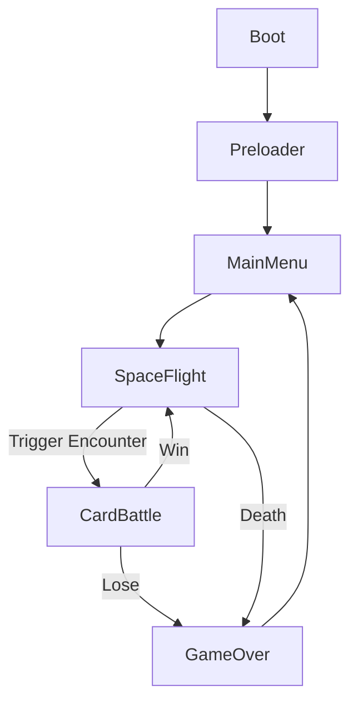

# 🛠️ MVP Game Loop: SpaceFlight + CardBattle

This document defines the **core logic, mechanics, scene flow, and data structures** required to implement the MVP vertical slice of the game. It focuses on an endless 2D spaceflight scene with arcade-style combat, pickups, and random encounters that launch a card-based battle scene.

---

## 🎮 Gameplay Overview

The player pilots a spaceship in an endless, side-scrolling space environment. They can:

- **Dodge obstacles** (asteroids, wreckage)
- **Fight enemy ships** (real-time shooting)
- **Mine floating stations** (hold position)
- **Collect loot crates** (cards, items, materials)
- **Trigger card-based encounters**

Encounters pause the flight and launch a **CardBattleScene**, where the player resolves a challenge using their card deck.

---

## 🔁 Scene Flow



### Required Scenes (MVP):
- `BootScene`
- `PreloaderScene`
- `MainMenuScene`
- `SpaceFlightScene`
- `CardBattleScene`
- `GameOverScene`

---

## 🚀 SpaceFlightScene

### Objective
Endless flying shooter where the player dodges, fights, mines, and loots. Encounters are triggered based on distance/time.

### Components
- **PlayerShip** (Sprite w/ Arcade physics)
- **SpawnerSystem** (manages enemies, loot, hazards, encounter triggers)
- **ProjectileManager** (player bullets)
- **InputHandler** (WASD or Arrow keys + shoot key)
- **LootSystem** (handles pickups)

### Entity Types
- **EnemyShip**: flies into screen and shoots
- **Asteroid**: static or moving, collision causes damage
- **LootCrate**: touch to collect rewards
- **MiningStation**: hover for 2s to extract
- **EncounterTrigger**: floating rift that starts card battle

### Spawn Logic
```ts
spawnTimer += delta
if (spawnTimer > spawnInterval) {
  pickRandom([enemy, asteroid, loot, trigger])
  spawnEntity()
  spawnTimer = 0
}
```

### Trigger Encounter
```ts
if (overlap(player, encounterTrigger)) {
  this.scene.pause()
  this.scene.launch('CardBattleScene', { deck, encounter })
}
```

### Upon Death
```ts
if (player.hp <= 0) {
  this.scene.stop('SpaceFlightScene')
  this.scene.start('GameOverScene')
}
```

---

## 🃏 CardBattleScene

### Objective
Resolve an encounter using cards. On win, return to flight. On loss, game over.

### Components
- **DeckManager**
- **CardRenderer** (render hand)
- **TurnManager** (player turn → enemy turn → repeat)
- **EncounterData** (passed from SpaceFlight)

### Data Flow
```ts
this.scene.launch('CardBattleScene', {
  deck: playerDeck,
  encounter: enemyData,
})
```

### Win Condition
- Enemy HP <= 0

### Lose Condition
- Player HP <= 0

### On Win:
```ts
this.scene.stop('CardBattleScene')
this.scene.resume('SpaceFlightScene')
```

### On Lose:
```ts
this.scene.stop('CardBattleScene')
this.scene.stop('SpaceFlightScene')
this.scene.start('GameOverScene')
```

---

## 📦 Loot Types
- `Card`: added to deck (if valid)
- `Material`: placeholder for meta upgrades later
- `Item`: optional, used for ship/crew later

---

## 🧠 Data Structures (Simplified MVP)

### Player
```ts
interface PlayerState {
  hp: number;
  shield: number;
  deck: Card[];
  collectedCards: Card[];
  position: { x: number; y: number };
}
```

### Card
```ts
interface Card {
  id: string;
  name: string;
  cost: number;
  effects: CardEffect[];
  type: 'combat';
}
```

### CardEffect
```ts
interface CardEffect {
  action: 'damage' | 'heal';
  amount: number;
  target: 'self' | 'enemy';
}
```

### Encounter
```ts
interface Encounter {
  id: string;
  enemyName: string;
  enemyHp: number;
  enemyDeck: Card[];
}
```

---

## ✅ MVP Goals Recap
- ✅ Flying scene with basic shooting and dodge
- ✅ Random spawning of interactive elements
- ✅ Card battle system triggered from flight
- ✅ Card win/lose logic and transitions

Would you like a GitHub-style README or want this converted into Notion/wiki format next?
