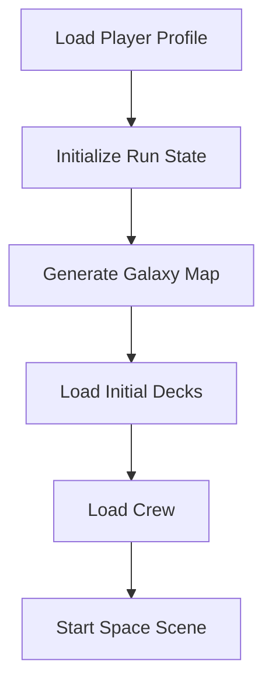
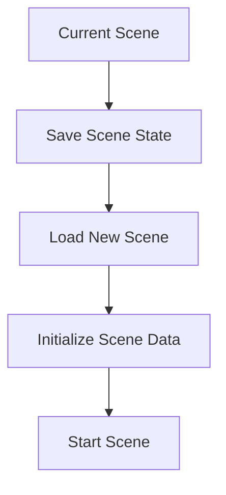
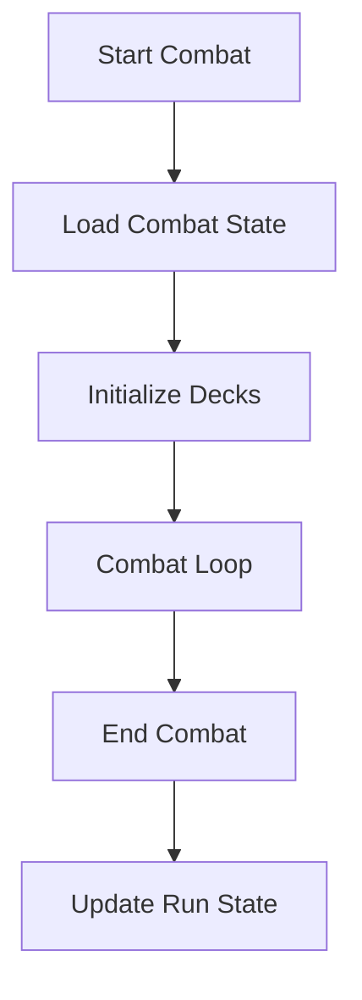

# Data Flow Documentation

## Overview
This document describes how data flows through the game systems, from storage to runtime and back.

## 1. Data Storage

### Client-Side Storage
```typescript
// Local Storage
interface LocalStorage {
  settings: GameSettings;
  lastSave: SaveData;
  achievements: Achievement[];
}

// Runtime State
interface RuntimeState {
  currentScene: string;
  gameState: GameState;
  activeSystems: System[];
  eventQueue: Event[];
}
```

### Server-Side Storage
```typescript
// Database Collections
interface Database {
  players: PlayerProfile[];
  runs: RunHistory[];
  cards: CardData[];
  events: EventData[];
  factions: FactionData[];
}
```

## 2. Data Flow Patterns

### 1. Game Start Flow


### 2. Scene Transition Flow


### 3. Combat Flow


## 3. State Management

### Run State
```typescript
interface RunState {
  // Core State
  playerId: string;
  seed: string;
  currentCharacter: string;
  
  // Game World
  galaxyMap: GalaxyNode[];
  currentLocation: string;
  visitedLocations: string[];
  
  // Player Resources
  decks: {
    combat: Card[];
    negotiation: Card[];
    crew: Card[];
    exploration: Card[];
  };
  inventory: InventorySlot[];
  crew: CrewMember[];
  
  // Game Progress
  factionStates: Record<string, FactionReputation>;
  storyFlags: string[];
  questProgress: QuestProgress[];
  
  // Ship Status
  shipStatus: ShipStatus;
  
  // Meta Data
  runStartTime: Date;
  lastSaveTime: Date;
}
```

### Scene State
```typescript
interface SceneState {
  sceneId: string;
  activeEntities: Entity[];
  activeSystems: System[];
  eventQueue: Event[];
  uiState: UIState;
  cameraState: CameraState;
}
```

## 4. Data Synchronization

### Auto-Save System
```typescript
interface AutoSaveSystem {
  interval: number; // milliseconds
  maxSaves: number;
  saveData: SaveData;
  
  // Methods
  save(): Promise<void>;
  load(): Promise<void>;
  cleanup(): void;
}
```

### Cloud Sync
```typescript
interface CloudSync {
  // Methods
  syncToCloud(): Promise<void>;
  syncFromCloud(): Promise<void>;
  resolveConflicts(): Promise<void>;
  
  // State
  lastSyncTime: Date;
  syncStatus: SyncStatus;
  pendingChanges: Change[];
}
```

## 5. Event System

### Event Flow
```typescript
interface EventSystem {
  // Event Queue
  queue: Event[];
  
  // Event Types
  types: {
    COMBAT: CombatEvent;
    NEGOTIATION: NegotiationEvent;
    EXPLORATION: ExplorationEvent;
    STORY: StoryEvent;
  };
  
  // Methods
  dispatch(event: Event): void;
  subscribe(type: string, handler: EventHandler): void;
  unsubscribe(type: string, handler: EventHandler): void;
}
```

## 6. System Communication

### Inter-System Communication
```typescript
interface SystemCommunication {
  // Message Types
  messages: {
    SYSTEM_STATE: SystemState;
    ENTITY_UPDATE: EntityUpdate;
    EVENT_TRIGGER: EventTrigger;
  };
  
  // Methods
  send(message: Message): void;
  receive(message: Message): void;
  broadcast(message: Message): void;
}
```

## 7. Data Persistence

### Save System
```typescript
interface SaveSystem {
  // Save Types
  types: {
    AUTO: AutoSave;
    MANUAL: ManualSave;
    CHECKPOINT: CheckpointSave;
  };
  
  // Methods
  createSave(type: SaveType): Promise<void>;
  loadSave(saveId: string): Promise<void>;
  deleteSave(saveId: string): Promise<void>;
  
  // State
  saves: Save[];
  currentSave: Save;
}
```

## 8. Data Validation

### Validation System
```typescript
interface ValidationSystem {
  // Validation Rules
  rules: ValidationRule[];
  
  // Methods
  validate(data: any): ValidationResult;
  sanitize(data: any): SanitizedData;
  
  // State
  validationErrors: ValidationError[];
}
``` 