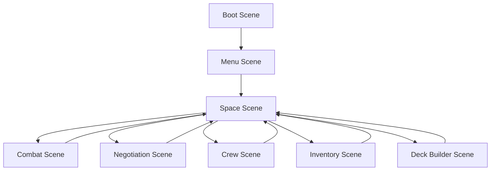

# Game Scenes Documentation

## Overview
This document details all the game scenes, their purposes, and how they interact with each other.

## 1. Boot Scene

### Purpose
- Initialize game systems
- Load core assets
- Set up configuration
- Handle initial game state

### Key Components
```typescript
class BootScene extends Phaser.Scene {
  // Lifecycle Methods
  preload(): void;
  create(): void;
  update(): void;
  
  // Systems
  initSystems(): void;
  loadAssets(): void;
  setupConfig(): void;
  
  // State
  loadingProgress: number;
  systems: System[];
  config: GameConfig;
}
```

## 2. Menu Scene

### Purpose
- Main menu interface
- Game options
- Save/load management
- Character selection

### Key Components
```typescript
class MenuScene extends Phaser.Scene {
  // UI Elements
  mainMenu: MenuUI;
  optionsMenu: OptionsUI;
  saveMenu: SaveUI;
  characterSelect: CharacterSelectUI;
  
  // Methods
  createMenu(): void;
  handleMenuSelection(): void;
  saveGame(): void;
  loadGame(): void;
}
```

## 3. Space Scene

### Purpose
- Main game world
- Galaxy map navigation
- Location interaction
- Travel system

### Key Components
```typescript
class SpaceScene extends Phaser.Scene {
  // World Elements
  galaxyMap: GalaxyMap;
  playerShip: Ship;
  locations: Location[];
  events: Event[];
  
  // Systems
  navigation: NavigationSystem;
  travel: TravelSystem;
  interaction: InteractionSystem;
  
  // Methods
  updateMap(): void;
  handleTravel(): void;
  processEvents(): void;
}
```

## 4. Combat Scene

### Purpose
- Space combat
- Card-based battles
- Ship status management
- Combat rewards

### Key Components
```typescript
class CombatScene extends Phaser.Scene {
  // Combat Elements
  playerShip: Ship;
  enemyShip: Ship;
  combatDeck: Deck;
  battlefield: Battlefield;
  
  // Systems
  turnSystem: TurnSystem;
  cardSystem: CardSystem;
  damageSystem: DamageSystem;
  
  // Methods
  startCombat(): void;
  processTurn(): void;
  resolveCombat(): void;
}
```

## 5. Negotiation Scene

### Purpose
- Diplomatic encounters
- Trade negotiations
- Information gathering
- Faction relations

### Key Components
```typescript
class NegotiationScene extends Phaser.Scene {
  // Negotiation Elements
  negotiationDeck: Deck;
  npc: NPC;
  dialogue: Dialogue;
  options: Option[];
  
  // Systems
  dialogueSystem: DialogueSystem;
  influenceSystem: InfluenceSystem;
  tradeSystem: TradeSystem;
  
  // Methods
  startNegotiation(): void;
  processChoice(): void;
  resolveNegotiation(): void;
}
```

## 6. Crew Scene

### Purpose
- Crew management
- Skill development
- Equipment management
- Crew interactions

### Key Components
```typescript
class CrewScene extends Phaser.Scene {
  // Crew Elements
  crewList: CrewMember[];
  equipment: Equipment[];
  skills: Skill[];
  interactions: Interaction[];
  
  // Systems
  crewSystem: CrewSystem;
  equipmentSystem: EquipmentSystem;
  skillSystem: SkillSystem;
  
  // Methods
  updateCrew(): void;
  manageEquipment(): void;
  developSkills(): void;
}
```

## 7. Inventory Scene

### Purpose
- Item management
- Equipment handling
- Resource tracking
- Cargo management

### Key Components
```typescript
class InventoryScene extends Phaser.Scene {
  // Inventory Elements
  items: Item[];
  equipment: Equipment[];
  resources: Resource[];
  cargo: Cargo;
  
  // Systems
  inventorySystem: InventorySystem;
  equipmentSystem: EquipmentSystem;
  resourceSystem: ResourceSystem;
  
  // Methods
  updateInventory(): void;
  manageEquipment(): void;
  trackResources(): void;
}
```

## 8. Deck Builder Scene

### Purpose
- Deck construction
- Card management
- Deck testing
- Card acquisition

### Key Components
```typescript
class DeckBuilderScene extends Phaser.Scene {
  // Deck Elements
  cardPool: Card[];
  currentDeck: Deck;
  cardLibrary: CardLibrary;
  deckStats: DeckStats;
  
  // Systems
  deckSystem: DeckSystem;
  cardSystem: CardSystem;
  testSystem: TestSystem;
  
  // Methods
  buildDeck(): void;
  testDeck(): void;
  saveDeck(): void;
}
```

## Scene Transitions

### Flow Diagram


### Transition System
```typescript
interface SceneTransition {
  // Methods
  transitionTo(scene: string, data?: any): void;
  transitionFrom(scene: string): void;
  
  // State
  currentScene: string;
  previousScene: string;
  transitionData: any;
}
```

## Scene Communication

### Event System
```typescript
interface SceneEventSystem {
  // Event Types
  events: {
    SCENE_START: SceneStartEvent;
    SCENE_END: SceneEndEvent;
    SCENE_PAUSE: ScenePauseEvent;
    SCENE_RESUME: SceneResumeEvent;
  };
  
  // Methods
  emit(event: SceneEvent): void;
  listen(event: string, handler: EventHandler): void;
  removeListener(event: string, handler: EventHandler): void;
}
```

## Scene State Management

### State System
```typescript
interface SceneStateSystem {
  // State Types
  states: {
    ACTIVE: ActiveState;
    PAUSED: PausedState;
    TRANSITIONING: TransitioningState;
  };
  
  // Methods
  setState(state: SceneState): void;
  getState(): SceneState;
  saveState(): void;
  loadState(): void;
}
``` 