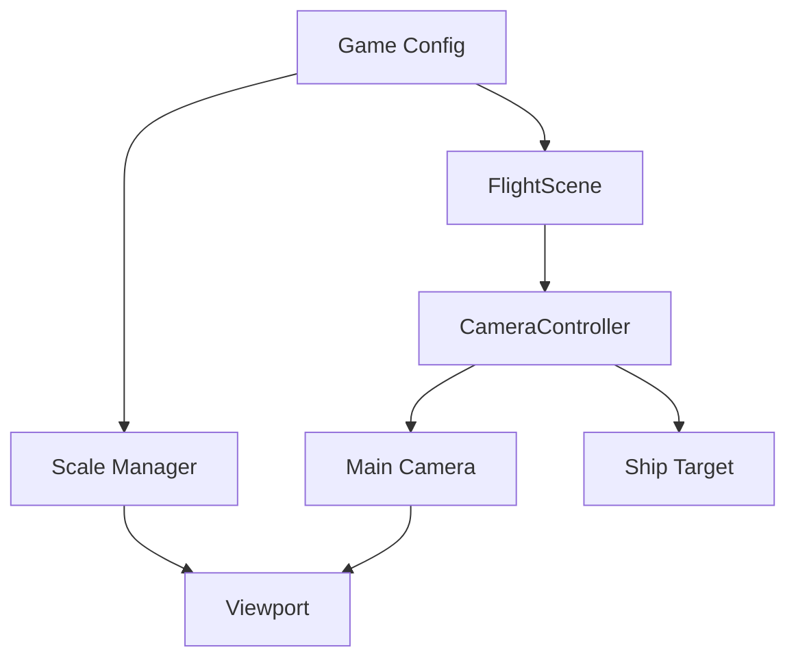

# Viewport & Camera System Design

## Overview
Implementation of a responsive, full-window game viewport with smooth camera controls and zoom functionality.

## Components

### 1. CameraController
Primary class responsible for managing camera behavior.

```typescript
class CameraController {
    private scene: Phaser.Scene;
    private camera: Phaser.Cameras.Scene2D.Camera;
    private target: Phaser.GameObjects.Sprite;
    private config: CameraConfig;
}
```

#### Properties
- `scene`: Reference to the current game scene
- `camera`: Main camera instance
- `target`: The game object camera follows (ship)
- `config`: Camera configuration settings

#### Configuration Interface
```typescript
interface CameraConfig {
    // Zoom Settings
    minZoom: number;     // 0.5x - Wide view
    maxZoom: number;     // 2.0x - Close-up view
    defaultZoom: number; // 1.0x - Normal view
    zoomSpeed: number;   // Zoom transition speed

    // Follow Settings
    lerpX: number;       // 0.09 - Horizontal follow smoothing
    lerpY: number;       // 0.09 - Vertical follow smoothing
    offsetX: number;     // Horizontal offset from target
    offsetY: number;     // Vertical offset from target

    // Deadzone (area where ship moves without camera following)
    deadzoneWidth: number;  // 30% of viewport width
    deadzoneHeight: number; // 30% of viewport height
}
```

### 2. Viewport Management
Handled through Phaser's Scale Manager in game config.

```typescript
interface ViewportConfig {
    mode: Phaser.Scale.RESIZE;
    width: '100%';
    height: '100%';
    min: {
        width: 800;
        height: 600;
    };
    max: {
        width: 1920;
        height: 1080;
    };
}
```

## System Relationships



## Event Flow

1. **Initialization**
   ```typescript
   Game Config → FlightScene → CameraController
   ```

2. **Runtime Flow**
   ```typescript
   Window Resize → Scale Manager → Camera Update
   Mouse Wheel → Zoom Handler → Camera Zoom
   Ship Movement → Camera Follow → Viewport Update
   ```

## Implementation Steps

### 1. Viewport Setup
```typescript
// game.ts
const config: Phaser.Types.Core.GameConfig = {
    scale: {
        mode: Phaser.Scale.RESIZE,
        width: '100%',
        height: '100%',
        // ... viewport config
    }
};
```

### 2. Camera Controller
```typescript
// src/controllers/CameraController.ts
export class CameraController {
    constructor(scene: Phaser.Scene, target: Phaser.GameObjects.Sprite) {
        this.setupCamera();
        this.setupZoom();
        this.setupEvents();
    }
}
```

### 3. Scene Integration
```typescript
// src/scenes/flight/FlightScene.ts
export class FlightScene extends Scene {
    private cameraController: CameraController;

    create() {
        this.cameraController = new CameraController(this, this.ship);
    }
}
```

## Testing Criteria

1. **Viewport Tests**
   - Window resizing maintains aspect ratio
   - No content clipping
   - Proper scaling on different screens

2. **Camera Tests**
   - Smooth follow behavior
   - Proper deadzone functionality
   - Correct boundary handling

3. **Zoom Tests**
   - Smooth zoom transitions
   - Proper min/max limits
   - Correct zoom center point

## Performance Considerations

1. **Optimization**
   - Use `roundPixels` for crisp rendering
   - Implement camera culling for off-screen objects
   - Optimize resize event handling

2. **Memory Management**
   - Clean up event listeners on scene shutdown
   - Proper disposal of camera controller

## Usage Example

```typescript
// In FlightScene
create() {
    // Create ship
    this.ship = this.physics.add.sprite(
        this.cameras.main.centerX,
        this.cameras.main.centerY,
        'ship'
    );

    // Initialize camera system
    this.cameraController = new CameraController(this, this.ship);
}
``` 